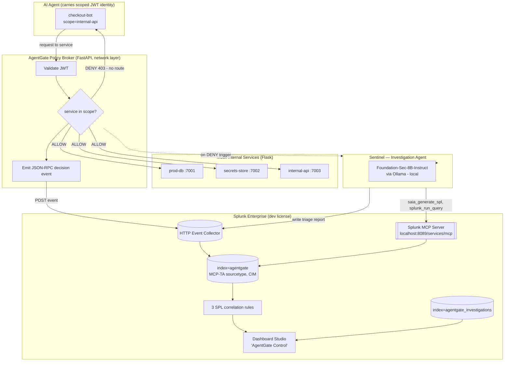

# AgentGate — Architecture Diagram

**The Zero-Trust Enforcement Plane for AI Agents** · Security Track · Splunk MCP Server bonus

This diagram shows (1) how AgentGate interacts with Splunk, (2) how the AI/agent integrates,
and (3) the data flow between services — the three things the hackathon requires here.

---

## System diagram

> If Mermaid does not render in a viewer, the ASCII flow in `SPEC.md` §3 is the same graph.

---

## 1. How AgentGate interacts with Splunk

- **Ingest (write path):** the broker POSTs every decision (ALLOW and DENY) to the Splunk
  **HTTP Event Collector** as a JSON-RPC event, using the **MCP-TA sourcetype** so the TA's
  CIM-compliant field extractions apply. Events land in `index=agentgate`.
- **Detection:** three **SPL correlation rules** run over `index=agentgate` (scope violation,
  sensitive-path access, high-denial-rate anomaly).
- **Investigation read path:** Sentinel reaches Splunk **through the Splunk MCP Server**
  (`https://localhost:8089/services/mcp`, encrypted-token auth) to pull incident context.
- **Visualization:** a native **Dashboard Studio** view reads `index=agentgate` and
  `index=agentgate_investigations`.

Splunk is structurally central: ingest, detection, agent-accessible query surface, and
presentation all live in Splunk — not in a sidecar.

## 2. How the AI / agent integrates

- The **monitored subject** is the AI agent whose requests the broker governs.
- The **investigation agent (Sentinel)** is the AI *tool*: on each denial it calls the Splunk
  MCP Server tools `saia_generate_spl` (natural language → SPL) and `splunk_run_query`
  (execute), then runs **Foundation-Sec-8B-Instruct locally via Ollama** to produce a triage
  report. This is the "Best Use of Splunk MCP Server" claim: the agent reasons in natural
  language and Splunk's own MCP tools do the SPL.
- Honest degradation: if the SAIA-backed `saia_generate_spl` is unreachable (it proxies to
  Splunk's cloud assistant), Sentinel templates the SPL locally but still executes it
  **through the MCP Server**; the report's `context_source` field records which path ran.
- Foundation-Sec runs **in-perimeter** (open weights, local) — no external LLM API, no data
  egress.

## 3. Data flow between services

1. Agent → Broker: request with `Authorization: Bearer <scoped-JWT>` and a target service.
2. Broker validates the JWT and checks the target against the token's `scope` allowlist.
3. ALLOW → proxied to the Flask service; DENY → 403 at the network layer.
4. Broker emits one JSON-RPC decision event → HEC → `index=agentgate`.
5. On DENY → Broker triggers Sentinel → Sentinel pulls context via MCP, reasons with
   Foundation-Sec, writes a triage report → `index=agentgate_investigations`.
6. SPL rules fire; Dashboard Studio renders the live feed, identity map, denial timeline, and
   latest investigation.

**Failure isolation:** enforcement and event emission never depend on the LLM or MCP. If
Sentinel or Ollama is unavailable, the deny still fires and the event still lands in Splunk;
only the narrative degrades.
